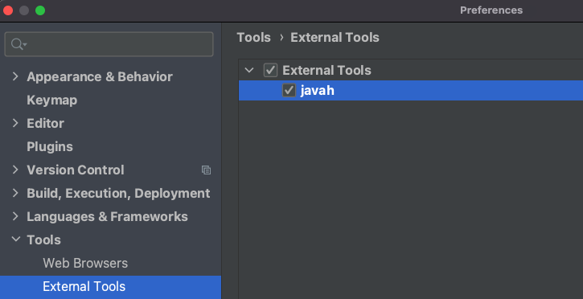

# Android NDK (Native Development Kit)

[](https://developer.android.com/ndk)  

## Tools > External Tools

 

### javah
| key                | value                                                                    |
|--------------------|--------------------------------------------------------------------------|
| Program            | /Library/Java/JavaVirtualMachines/temurin-8.jdk/Contents/Home/bin/javah  |
| Arguments          | -classpath "$Classpath$" -v -jni $`FileClass`$                           |
| Working directory  | $`ProjectFileDir`$/app/src/main/jni                                      |

### ndk-build
| key                | value                                                        |
|--------------------|--------------------------------------------------------------|
| Program            | /Users/pokeum/Library/Android/sdk/ndk/21.4.7075529/ndk-build |
| Arguments          |                                                              |
| Working directory  | $`ProjectFileDir`$/app/src/main                              |

### ndk-clean
| key                | value                                                        |
|--------------------|--------------------------------------------------------------|
| Program            | /Users/pokeum/Library/Android/sdk/ndk/21.4.7075529/ndk-build |
| Arguments          | clean                                                        |
| Working directory  | $`ProjectFileDir`$/app/src/main                              |

## ndk build

- **local.properties**
    ```
    ndk.dir=/Users/pokeum/Library/Android/sdk/ndk/21.4.7075529
    ```

- **build.gradle (:app)**
    ```groovy
    android {
        ndkVersion "21.4.7075529"
  
        externalNativeBuild {
            ndkBuild {
                path file("src/main/jni/Android.mk")
            }
        }
    }
    ```
  
- **Java Sample Code** (`HelloNDK.java`) → Rebuild Project → External Tools (`javah`) <details>

    ```java
    package com.pokeum.hellondk;
    public class HelloNDK {
        static {
            System.loadLibrary("com_pokeum_hellondk");
        }
        public native String helloNDK();
    }
    ```
  
    </details>

- app > src > main > **`jni`** (e.g. `com_pokeum_hellondk_HelloNDK.h`) <details>

    ```cpp
    /* DO NOT EDIT THIS FILE - it is machine generated */
    #include <jni.h>
    /* Header for class com_pokeum_hellondk_HelloNDK */

    #ifndef _Included_com_pokeum_hellondk_HelloNDK
    #define _Included_com_pokeum_hellondk_HelloNDK
    #ifdef __cplusplus
    extern "C" {
    #endif
        /*
         * Class:     com_pokeum_hellondk_HelloNDK
         * Method:    helloNDK
         * Signature: ()Ljava/lang/String;
         */
        JNIEXPORT jstring JNICALL Java_com_pokeum_hellondk_HelloNDK_helloNDK
        (JNIEnv *, jobject);

    #ifdef __cplusplus
    }
    #endif
    #endif
    ```

    </details>

- **Create `Android.mk` File** (e.g. app > src > main > jni > `Android.mk`) <details>

    ```mk
    LOCAL_PATH := $(call my-dir)
    include $(CLEAR_VARS)
    LOCAL_MODULE := com_pokeum_hellondk         # Library Name
    FILES := com_pokeum_hellondk_HelloNDK.cpp
    LOCAL_SRC_FILES := $(FILES)
    LOCAL_LDLIBS := -llog
    include $(BUILD_SHARED_LIBRARY)
    ```

    </details>

- **Create C++ File** (e.g. app > src > main > jni > `com_pokeum_hellondk_HelloNDK.cpp`) <details>

    ```cpp
    #include <iostream>
    #include "com_pokeum_hellondk_HelloNDK.h"

    JNIEXPORT jstring JNICALL
    Java_com_pokeum_hellondk_HelloNDK_helloNDK(JNIEnv *env, jobject obj)
    {
        std::string msg = "Hello, NDK!";

        // convert c-string to java-string
        jstring ret = env->NewStringUTF(msg.c_str());
        return ret;
    }
    ```
  
    </details>
  
- `libcom_pokeum_hellondk.so`
  - app > build > intermediates > merged_native_libs
  - app > build > intermediates > ndkBuild